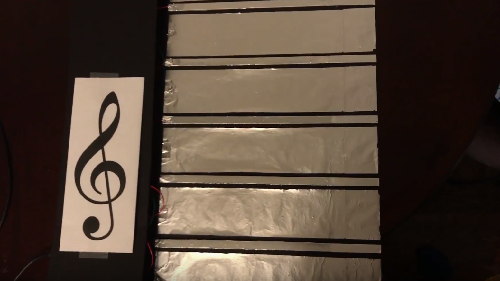

### A Digital Instrument with a Staff-Inspired Interface
Within ten weeks, I sought to create an instrument that could help students learn to read music notation. This idea was inspired by a student of mine on the autism disorder spectrum, who was learning to recognize notes on a staff. Unfortunately, the traditional method of mapping both the pitch to an instrument's keys (in our case piano keys) and to its representation on the staff was ineffective since he had an unconventional learning style.

Thinking about this problem more, I wondered in general why music notation had to be taught in this complicated way. Wouldn't it help students, no matter their cognitive ability, if the instrument used to play musical scores looked exactly like the score itself? Then, wouldn't the pitch-to-key mapping be less confusing? The note you see would be the note you play, which would then be the note you hear. Below, I describe the **Skorbord**, which is my attempt to solve this issue.

*Figure 1: Skorbord Interface*

It is a digital instrument played with two handhold note "stampers" which interact with an interface that resembles a musical staff. Not only can this instrument be used in a pedagogical setting, but with further work, it could be implemented as an alternative to the conventional, keyboard formatted MIDI controller, which is a possibility with performative and compositional implications.

### Instrument Description
As mentioned, the instrument is played with two controllers which I call "note stampers" since the interaction evokes a stamping motion. When the stamp makes contact with the line or space on the staff interface, a sound is produced.

*Figure 2: Note Stampers*

*Figure 3: Stampers in action*

Through a Max patch, users can change the MIDI instrument to produce a different sound, like an Acoustic Grand Piano or a String pad. Users can also transpose, change octaves, and switch between treble or bass clef. An accompanying visual displays the note being played by the instrument with accidentals if either of the buttons are pressed.

*Figure 4: Skorbord's Max patch*

In its current form, the user can play, on the treble clef, notes D3 (using MIDI naming conventions here) to G4. By pressing buttons on the stampers, users can reach pitches by half-steps. This range is similar for the bass clef since I chose not to include any ledger notes. This decision was a practical one since I was short on input pins on the Arudino controller (more technical information below), and I had not yet thought of a solution that could incorporate the ledger notes without sacrificing the visual similarity to a staff or the ease of use for the instrumentalist.

### Skorbord Video Demonstration

<iframe src="https://www.youtube.com/embed/84eGUzAklPM" width="640" height="360" frameborder="0" style="position:absolute;width:100%;height:100%;left:0" allowfullscreen></iframe>

### Technical Information
To make this prototype, I used an Arduino as a glorified MakeyMakey board. On the bottom of the stamps are Piezo sensors which serve two purposes: (1) close circuits and trigger notes and (2) sense vibrations to determine note velocity. The lines and spaces of the staff interface are covered with aluminum foil (a conductive material), which when touched by the Piezo sensor act as a button closing a circuit.

*Figure 5: Arduino and breadboard*

*Figure 6: Piezo Sensors attached to bottom of stampers*

By this point, I have used all of the digital inputs on the Arudino, but as you may recall, there are buttons on the stampers (four in all) which alter the pitch by a half-step. To detect these inputs, I created a resistance ladder on the breadboard. This technique involves a set of resistors of different strengths, which are used to determine which button is being pressed.

Next, to generate sounds, I connect the controller to my computer and run it through a Max patch that translates the serial data coming from the controller into MIDI information. I also use Max to generate an accompanying visual that displays the note being played. This is an addition that I felt could be useful in a pedagogical setting since the student could confirm that the correct note is being played without having to look down at the instrument.

Other physical materials include black foam core for the body, styrofoam cones for the stamps, and aluminum bars for the lines of the staff.

### Takeaways and future work
While I weaned much theoretical knowledge from academic papers, and hardware hacking sensibilities from workshops and working with my hands, the biggest lesson learned is...

...that it's hard to solder wire to aluminum bars without sufficient heat.... (I'm more of CS than CE!) However, I did find that a clutch solution is **conductive epoxy**. This was such a simple but crucial fix to the obstacle I was having of making consistent connections to the conductive elements of the interface.

Unfortunately, I never got to test this instrument with my student before the lessons ended for the year, but going forward I would like to have user tests and get feedback to improve the design. However, before testing I will need to solve the latency issue regarding the delay between when the note is played and when the instrument makes a sound. Some part of the logic, whether its in the Arduino code, or the Max patch, is slowing down the processing, and it needs to be addressed.

Finally, as I mentioned at the beginning, I could see this device turning into a full-fledged MIDI controller with buttons and dials to adjust MIDI parameters or flip through samples and sounds.

This was a fun project, and I want to thank Dr. Bryan Pardo, Ethan Manilow, Dr. Michael Gurevich, and the other Digital Luthiers for their time, knowledge, and advice throughout the process.

Khoa Truong\\
Khoa.truong@u.northwestern.edu\\
Northwestern University, EECS 495-050 (SAI 402-0-21): Digital Luthier
